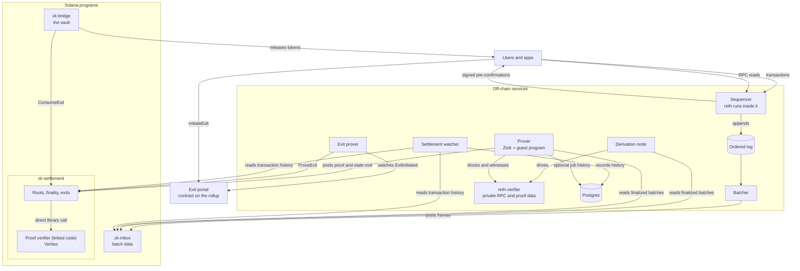

# Architecture

Rome ZK lane is an EVM rollup that sequences transactions off-chain and uses Solana for settlement,
data availability and proof verification. This page describes the code in this repository, how its
components fit together, and the trust assumptions an operator needs to understand.

The on-chain programs use the Agave 4.3.0-line crate set pinned in
[`Cargo.toml`](../Cargo.toml), including `solana-program = 4.1.0`, and build with
`cargo build-sbf --arch v3` (SBPF v3). [`scripts/check-sbpf-v3.sh`](../scripts/check-sbpf-v3.sh)
checks the compiled artifacts.

## Components at a glance

The code contains four Solana programs, one contract for the rollup, and the off-chain services below.
The production ZisK guest lives in a separate repository. This is a logical data-flow diagram, not a
record of live deployments.

| Part | Components | Purpose |
|---|---|---|
| Sequence and publish | Sequencer, embedded reth, batcher | Execute ordered transactions and publish their data to Solana. |
| Derive and prove | Derivation node, reth-verifier, prover, guest | Reconstruct the chain and prove batch execution. |
| Settle and observe | zk-inbox, zk-settlement, proof verifier (Veritas), settlement watcher | Store batch data, verify proofs, expose final roots and record history. |
| Withdraw | Exit portal, exit prover, zk-bridge | Record a withdrawal, prove its inclusion and release tokens on Solana. |

The [detailed component table](#components) gives each component's code and who runs it.

**Proof verifier.** Veritas ([`programs/veritas`](../programs/veritas/README.md)) is Rome's verifier for ZisK's
PLONK proofs. zk-settlement links it with the `no-entrypoint` feature and runs `verify_zisk` inside
`PostRootProved`, with no cross-program call. The prover links the same code and checks each proof
off-chain before posting it.

**reth-verifier** is a separate process: an upstream reth node driven by the derivation node over the
Engine API. It re-executes blocks derived from Solana and serves RPC, execution witnesses and the state
proofs the prover and exit prover need. It runs reth's testing API, so keep it off the public network.
The public RPC is served by the sequencer, which embeds a separate reth instance to produce blocks.

## Components

“Who runs it” describes the role in a chain deployment. It does not imply that a public deployment is
already available. Each linked directory has a README with the component's configuration and tests.

| Component | Code | What it does | Who runs it |
|---|---|---|---|
| Sequencer | [`crates/rome-zk-sequencer`](../crates/rome-zk-sequencer) | Accepts and orders transactions, executes them, durably logs signed sub-blocks, and returns pre-confirmations. | Chain operator |
| Execution engine | [`crates/rome-zk-executor-reth`](../crates/rome-zk-executor-reth), [`crates/rome-zk-executor-api`](../crates/rome-zk-executor-api) | Embeds upstream reth v2.5.2 behind the `Executor` trait. Executes the ordered transactions, computes roots and persists state. | Inside the sequencer |
| Batcher | [`crates/rome-zk-batcher`](../crates/rome-zk-batcher) | Reads the ordered log, compresses blocks into frames, posts them to zk-inbox and finalizes each batch's accumulator. | Chain operator |
| Derivation node | [`crates/rome-zk-derive`](../crates/rome-zk-derive) | Reads finalized Solana inbox and settlement data and drives reth over the Engine API to reconstruct the chain. | Chain operator or an independent observer |
| reth-verifier | Upstream reth v2.5.2; no Rome implementation | Re-executes derived blocks and serves RPC, execution witnesses and state proofs to the prover and exit prover. Its testing API must stay off the public network. | Alongside a derivation node, on a private network |
| Prover | [`crates/rome-zk-prover`](../crates/rome-zk-prover) | Follows finalized inbox batches, builds inputs, runs `cargo-zisk prove --plonk`, checks the result locally and posts `PostRootProved`. Can record job history in Postgres. | Chain operator |
| Prover input generator | [`crates/rome-zk-prover-input`](../crates/rome-zk-prover-input) | Fetches inbox data, blocks and execution witnesses and writes the guest's two input files. Available as a library and CLI. | Inside the prover, or invoked separately |
| Batch guest | `rome-protocol/zisk-eth-client`, `crates/clients/rome/guest` (`guest-rome`) | Checks that blocks match inbox data and execute correctly, then commits the batch's public values. The chain's genesis and fee recipient are compiled into the guest. | Executed by ZisK during proving |
| Settlement watcher | [`crates/rome-zk-settlement-watcher`](../crates/rome-zk-settlement-watcher) | Reads inbox and settlement transaction history into Postgres and derives batch and exit status. Never writes to Solana. | Chain operator or an independent observer |
| Exit portal | [`contracts/exit-portal`](../contracts/exit-portal) | `RomeExitPortal` records a native-asset withdrawal message and emits `ExitInitiated`. | Contract deployed on the rollup |
| Exit prover | [`crates/rome-zk-exit-prover`](../crates/rome-zk-exit-prover) | Watches portal events, obtains and locally checks an Ethereum storage proof, and sends `ProveExit` against a final batch root. | Chain operator |
| zk-inbox | [`programs/zk-inbox`](../programs/zk-inbox) | Stores transaction chunks and reduces each batch to a Merkle commitment. | Solana validators execute the deployed program |
| zk-settlement | [`programs/zk-settlement`](../programs/zk-settlement) | Registers chains, accepts roots, tracks finality, serves `RootView`, verifies exit inclusion and manages fees and governance. | Solana validators execute the deployed program |
| Proof verifier (Veritas) | [`programs/veritas`](../programs/veritas) | The PLONK verifier checks ZisK proofs over BN254. zk-settlement links this code and runs it inside `PostRootProved`; the prover runs the same check off-chain before it posts. | Solana validators inside zk-settlement, using `alt_bn128` syscalls; the prover off-chain |
| zk-bridge | [`programs/zk-bridge`](../programs/zk-bridge) | Holds the SPL-token vault, consumes a proved exit through zk-settlement and transfers the corresponding amount to its recipient. | Solana validators execute the deployed program |

Three crates are placeholders with no service behavior yet:

| Crate | Planned role |
|---|---|
| [`rome-zk-challenger`](../crates/rome-zk-challenger) | Open and resolve per-block disputes against a wrong root. |
| [`rome-zk-indexer`](../crates/rome-zk-indexer) | Stream execution results into Postgres. |
| [`rome-zk-explorer-api`](../crates/rome-zk-explorer-api) | Serve explorer queries over indexed execution and settlement data. |

Crates not listed as services or placeholders provide libraries, clients or test support; see
[Crate map and shared-code ownership](#crate-map-and-shared-code-ownership).
[`rome-zk-prover-input-cross-repo-wire`](../crates/rome-zk-prover-input-cross-repo-wire) tests the host and
guest input formats together. [`guest/rome-zk-bench-decode`](../guest/rome-zk-bench-decode) is a measurement
guest, not the production guest.

The system uses upstream releases of reth, ZisK and the Solana crates. Postgres stores the watcher's
history and, when enabled, the prover's job history. The prover and input-generator crates have separate
Cargo workspaces and lockfiles; they are excluded from the root workspace to preserve compatibility
with the guest's dependency versions.

## Deployment

An operator runs the sequencer and batcher to publish a chain's transactions. A derivation node and its
reth instance reconstruct that chain from Solana. They need access to the chain's genesis and to the
Solana data being derived; they do not need a connection to the sequencer.

A dedicated prover deployment is planned to run its own derivation node and reth-verifier, so it can
build inputs independently from Solana. That deployment is not running yet. The prover combines batch
following, the ZisK subprocess and root posting in one service. Its Postgres job history is optional;
the chain remains its progress cursor.

Keep only the chain's root-authority key (the `PostRootProved` fee payer) on the prover host and hold the
registry-authority key separately, so a compromised prover can post proofs but cannot change verifying
keys, fees or registry-controlled configuration.

The portable [`deploy/rollup/`](../deploy/rollup/) directory is available, with setup and commands in its
[operator runbook](../deploy/rollup/README.md). Public devnet programs, published images and the guest build
for your chain id come later. The component READMEs document each service's configuration and commands. The
public release is intended to provide software and instructions for running a chain; Rome's deployment
and monitoring configuration stays private.

## Data flow: one transaction, start to finish

1. **Submission.** A wallet sends a raw EVM transaction to the sequencer's JSON-RPC endpoint
   (`eth_sendRawTransaction`).
2. **Admission and ordering.** The sequencer validates the transaction (signature, nonce, funds,
   intrinsic gas) and places it in a bounded FIFO admission queue — arrival order is sealing order,
   always; there is no fee-ordered mempool.
3. **Sub-block sealing (every 50 ms) — or nothing, when idle.** The sequencer executes admitted
   transactions against the embedded execution engine, builds a signed sub-block header (chain, block,
   sub-block index, timestamp, transaction root, receipts root, gas used, previous hash), and appends it —
   with the transactions it contains — to the durable ordered log, fsynced before anything is
   acknowledged. Only after that append does the sequencer return a signed pre-confirmation to the sender
   and publish it on its pre-confirmation feed. A tick with no ready transactions, when no block is
   already open, writes nothing at all and never touches the execution engine — by default (`[profile]`'s
   `empty_block_interval_secs = 0`) a quiet chain sits idle indefinitely rather than sealing an empty
   block every tick; a chain that wants a regular timestamp even while idle can opt into sealing one at
   most every N seconds instead. Once a block has actually opened, every later sub-block in it seals
   regardless of content — the idle gate only ever decides whether a NEW block opens, never whether an
   already-open one finishes.
4. **Block sealing (every 1 s, every 20th sub-block).** The execution engine computes the block's state
   root once, over the accumulated sub-blocks, under a block environment (timestamp, gas limit,
   `prevRandao`, coinbase, base fee) that was committed *before* the first sub-block of the block executed
   — so a pre-confirmation can never diverge from the block it is later sealed into.
5. **Batching (the batcher, reading the ordered log's tail).** The batcher groups the log's blocks into
   batches of at most `blocks_per_batch` **consecutive** blocks (ten by default, 10 s), either by reading
   the whole log once (`--once`) or by continuously tailing it (`--follow`); either way a batch's first
   block always continues immediately from the previous batch's last block, and a gap in the log refuses
   rather than silently posting around it. A partial group also closes on its own once it has held its
   first block for `batch_close_after_secs` (default 60 s) — measured on the batcher's own receipt clock,
   never a block's own timestamp, so a chain running well below its block-count cap (or sitting idle
   between bursts) still posts on a bounded cadence instead of waiting forever for a group that may never
   fill; an empty group never closes this way. `--follow` checks this on every tick, whether a new block
   just arrived or the log went quiet; `--once` reads the whole log and posts its own trailing partial
   group once, at the end, exactly as it always has. Each batch is RLP-encoded and compressed as one stream, cut
   into frames of at most 3,681 bytes each. Each frame becomes the body of one inbox chunk, posted as
   exactly one Solana transaction (an `Open` + `Write` + `Seal` sequence) using the SIMD-0385 V1
   transaction format and meeting the wire-format constraints every client
   transaction must satisfy. Up to `batches_in_flight` batches (default 2) post concurrently: the next
   batch's `OpenBatch` follows as soon as the current one confirms, chunk lanes overlap freely, and
   `FinalizeBatch` alone stays strictly ordered across batches — a bounded window that overlaps the
   cluster's own inclusion latency with the next batch's work instead of paying it serially. Cadence
   (per-batch open/finalize confirm time, window occupancy, and how far the log's tail runs ahead of the
   last finalized block) is registered as Prometheus metrics (`Metrics::render`), served over the
   batcher's own `/metrics` HTTP listener (the same reth-free responder the sequencer serves, pulled into
   `rome-zk-metrics-http` so both can share it) and scraped by Prometheus as a distinct target.
6. **Accumulation.** Each sealed chunk contributes one leaf (`keccak(chunk index ‖ keccak(chunk body))`)
   to a per-batch Merkle accumulator, tracked in the inbox program's batch account. Seals are
   order-independent, so this step is fully parallel; once every expected chunk is sealed,
   `FinalizeBatch` reduces the leaves to a single Merkle root and computes the batch's commitment
   (`acc`) over the chain id, batch id, the batch's opening slot, the expected chunk count, the Merkle
   root and the (currently always-empty) forced-lane root. `FinalizeBatch` requires the batch's own
   `authority` to sign (the same authority `OpenBatch` recorded) — a third party can seal every leaf
   itself (permissionless) but cannot finalize the batch, so it can never finalize a later batch id ahead
   of the real poster's own still-open one.
7. **Root posting (the poster, every batch).** Once every chunk of a finalized batch is itself
   Solana-finalized, the poster submits `PostRootProved`. A permissionless chain (`chain_id >= 2^32`)
   starts with an empty verifier registry: `InitChainV2` rejects caller-supplied entries with
   `RegistryEntriesNotAllowed` (82), and Rome adds the chain's key afterwards with `SetRegistryEntry`.
   Proofs need an active registered key. Permissionless chains reject unproved `PostRoot` with
   `UnprovedRootNotAllowed` (83) before any account read, write or fee transfer; Rome's reserved-range
   chains can still use it. Both posting paths check the previous batch, previous state root, first
   block number and inbox commitment. On every chain, both `PostRootProved` layouts also require the
   proof's `parent_hash` to equal `root.block_hash` when `head_pending_batch == 0`, or the predecessor
   pending account's `last_block_hash` otherwise. A mismatch returns `PredecessorHashMismatch` (84)
   before the pairing check or any write.
8. **Finality.** `PostRootProved` writes a `Final` batch in the same transaction and advances the finality
   head when the batch is next in order. On reserved chains, `FinalizeBatch` can also finalize an
   unproved pending batch once its window elapses with no open dispute and its predecessor is final.
   These two instructions advance the head only in order. A permissionless chain's first proved batch
   also makes its deposit eligible for refund: it already meets `head_final_batch >= 1`. The alternative
   refund trigger, `posted_batches >= 10`, remains defense in depth.
9. **Reading a final root.** `RootView` is the settlement program's cross-program-invocable read. It
   returns a batch's `{number, parent_hash, block_hash, state_root}` tuple only at or behind the finality
   head; an older batch also needs its own still-live `Final` pending account. `RootView` and `ProveExit`
   share `final_root_tuple`, which returns `NotFinal` for a permissionless chain's genesis (batch 0)
   while `head_final_batch == 0`. The chain owner supplied that genesis at registration; the chain has
   no final root until its first proved batch. Reserved chains keep their genesis as final. Consumers
   can combine a final-root read with an asset transfer in one Solana transaction without accepting a
   pending root.

## Exit lifecycle: prove, release, and how the watcher tracks it

1. **`initiateExit`** on the L2 exit portal (`contracts/exit-portal`) records a message hash in
   `sentMessages` (storage slot 0) and emits it as an event; the native asset stays on L2 — there is no
   `withdraw`, only the twin asset a Solana vault later releases.
1a. **The exit prover** (`crates/rome-zk-exit-prover`) is what actually turns that event into a
    `ProveExit` call: it watches the portal for `ExitInitiated` (`eth_getLogs`), fetches an
    `eth_getProof` of the message's inclusion against the newest Final batch's `state_root`, and verifies
    that proof LOCALLY before ever sending — a doomed proof spends no fee. If the verifier node cannot
    yet serve state at that batch's block (`--rpc.eth-proof-window`), it retries against a later Final
    root once the chain head advances; a message it cannot yet prove simply waits for the next poll —
    nothing about `sentMessages` expires. Configure reth's `--rpc.eth-proof-window` to cover the
    final roots the exit prover needs; reth's default is 0 (the current tip only), so raise it and run
    reth-verifier as an archive node. The setting limits how far back a proof request may reach;
    it does not restore pruned state.
2. **`ProveExit`** (28, `programs/zk-settlement`) proves that message's inclusion — an Ethereum
   Merkle-Patricia account proof of the portal (its address bound from the chain's `exit_config`, never a
   caller-supplied argument) plus a storage proof of `sentMessages[message_hash]` — against a FINAL batch's
   `state_root` (the same finality predicate `RootView` uses). A successful call burns a persistent,
   per-nonce replay bit (`exit_nullifier`) and writes an `exit_record` (`STATUS_PROVED`), enforcing a
   per-challenge-window cap along the way — a call the exit prover's own send lands `ExitCapExceeded` on
   is re-queued to the next window rather than treated as a failure.
3. **`ConsumeExit`** (29, `programs/zk-settlement`) is the release: the chain's registered bridge program
   (its identity read from `exit_config.bridge_program`) CPI-signs the `exit_consumer` PDA
   (`["exit_consumer", chain_id]`, derived under that program's own id) to authorise it — the only gate on
   who may call it, and one only that program's own runtime identity can ever satisfy (a PDA has no
   private key). It refunds the record's own `payer` (never a caller-supplied account) and recycles the
   record's rent by closing it. **The nullifier bit is never touched** — it is the permanent replay guard;
   the record is only ever the recyclable rent-paying wrapper around a single release.
4. **The bridge's own vault release** (`zk-bridge`'s `ReleaseExit`) is the caller that actually
   CPIs `ConsumeExit`, signed by its own `["exit_consumer", chain_id]` PDA: it reads the just-proved
   `exit_record` for the amount and recipient, CPIs `ConsumeExit` (the step above — closing the record and
   refunding its rent) FIRST, and only then transfers the decimal-scaled SPL amount from its vault to
   `record.sol_recipient`'s Associated Token Account (independently derived, never taken as an instruction
   argument) — all in one atomic transaction, so a vault that turns out underfunded, or any check along the
   way failing, fails the whole thing and the record stays PROVED (the CPI effects roll back), re-attemptable
   later. Consuming before transferring, rather than the reverse, is what makes a second `ReleaseExit`
   against the same record unconstructable: by the time any second call could run, the record is already
   gone.
5. **The settlement watcher** (`rome-zk-settlement-watcher`) observes both instructions under the same
   ingest kind the rest of the settlement program's history already uses (`ProveExit`/`ConsumeExit` are
   instructions of that one program, not a separate ingest source) and derives one `exit` row per message
   hash: `ProveExit` inserts it `proved` (with that transaction's own signature); `ConsumeExit` moves it to
   `released` (with its own signature), resolved purely by `message_hash` — mirroring how the inbox
   accumulator's own chunk rows resolve `Seal` back to an `Open` by account address rather than
   re-deriving one. The window index a `ProveExit` call computed on-chain (`Clock::slot`-derived, not an
   instruction argument) is not reconstructed here — the watcher reads only transaction history, never
   Solana account state, the same documented bound the inbox accumulator's own `root`/`acc` columns state.

## Persistence and restart recovery

The ordered log is the sequencer's source of truth — a signed sub-block is fsynced to it *before* any
pre-confirmation is returned. The execution engine's own database (Reth's MDBX + static files) is a
recomputable cache of that log, never itself authoritative: on restart, `RethExecutor::new` reports the
highest block its own database already reflects, and the sequencer's recovery path (`recovery::
replay_into_executor`) re-executes only the log's tail beyond that point — the common case is a handful
of sub-blocks, never a full replay from genesis.

Reth keeps headers/transactions/receipts in static files and indices/checkpoints in MDBX as two
independently-committed stores, written in a fixed order (static data fsync → static config rename → MDBX
commit). A crash between those steps leaves either one header row on disk that MDBX never committed or a static config one block ahead of MDBX. `RethExecutor::new`
handles both at open: it inspects any dangling row before Reth's own consistency check truncates it, refuses
an uncommitted row by name and lets Reth truncate it, or lets Reth prune a static-ahead row — then opens at
the block every layer agrees on and the ordered log replays the rest. A row that MDBX did commit (a shape a
crash cannot produce, covered as defence in depth) is verified four ways and re-committed forward. The one
residual gap — several dangling rows, or a row failing verification for another reason — leaves Reth's
account/storage state un-unwound; a later replay refuses loudly (`ReplayDiverged`, or
`UnexpectedStaticFileBlockNumber` at the first live persist with empty blocks) and the repair is to drop the
Reth datadir and rebuild from the log. The operator confirmation tool is `examples/inspect_datadir`; see
`rome-zk-executor-reth/README.md`, "Recovering from a torn persist".

## Trust model

**What Solana records.** The inbox stores transaction chunks and commits them in finalized batches.
Before accepting a root, settlement checks the referenced inbox batch and its commitment. Those bytes
are available from live accounts, or from archived transaction history after account rent is reclaimed.
This check establishes which inbox data the post references; proving that the state root results from
executing that data also requires the batch proof described below.

**What a pre-confirmation means.** The sequencer controls transaction order and inclusion. Its code
signs and durably logs a sub-block before acknowledging it, but a signed pre-confirmation is not Solana
finality. Conflicting signed claims can identify the signer; the challenge and slashing mechanisms that
would enforce a penalty are not implemented yet.

**What independent derivation checks.** A derivation node can reconstruct the chain from Solana and
compare the result with a posted root. That makes an incorrect result detectable. The challenge client
and forced-inclusion path are still planned, so detection does not yet provide a working dispute or
censorship-recovery mechanism. A sequencer can delay transactions, including withdrawal requests.

**Permissionless chains require proofs.** They reject unproved `PostRoot`, and their registration-time
genesis is not final. Their first final root must come from `PostRootProved`, checked against a key Rome
registered. Reserved chains retain a final genesis and the unproved path: a posted root can become final
after its window expires with no open dispute and its predecessor is final. With the challenge flow
still incomplete, that path depends on the poster's honesty. On every chain, the proved path's guarantee
depends on the guest behind the active key and on the program and registry authorities.

**What the proof binds.** The PLONK verifier (Veritas, `programs/veritas`) checks a proof against
its public signal. Veritas itself does not bind the proof to a block, batch or chain. This code runs
inside zk-settlement, so verification on the settlement path is governed by zk-settlement's upgrade
authority. The separately deployed verifier program is not called on this path. The settlement program
binds the signal to one of two layouts before accepting the post:

- **Layout 1, used by the batch guest,** commits 208 bytes: the chain id, first and last block numbers,
  batch opening time, timestamp drift bound, total gas used, parent hash, last block hash, state root,
  inbox commitment and forced-outcome commitment. `PostRootProved` checks those fields against the
  claimed batch, the inbox account and the chain configuration. The guest checks the inbox data against
  the witnessed blocks and validates their execution. The
  [prover README](../crates/rome-zk-prover/README.md) records the real proof fixture used to test this
  path through settlement.
- **Layout 2, the single-block header fallback,** binds a proof to `keccak(header)` and reads the block
  number, parent hash, state root and gas used from that header. It does not bind the block's
  transactions to the inbox commitment. It must not be treated as a proof of batch data availability
  and execution together.

The layouts are implemented in [`public_values.rs`](../crates/rome-zk-layouts/src/public_values.rs)
and checked in [`settle.rs`](../programs/zk-settlement/src/settle.rs).

**Which entry a proof binds to is itself an explicit, delayed rotation, not a program upgrade — and
rotation never touches another entry.** Every registry entry names a `(curve, scheme, vkey_hash,
layout_id)` tuple, and `SetRegistryEntry` keys on `(curve, scheme, vkey_hash)` — the same key
`PostRootProved`'s own lookup uses. Registering a new vkey never disturbs an existing entry that happens to
share only the curve, scheme and layout; naming an already-registered vkey again only ever updates that
one entry's own `activation_slot` (refusing `LayoutMismatch` if it is ever paired with a different layout —
one vkey is one ELF is one layout). A new entry is invisible to `PostRootProved` until `Clock::slot` reaches
its `activation_slot` — refused `RegistryEntryNotFound`, the identical refusal an entirely unregistered
vkey gets. The registry account remains readable, including the scheduled activation slot. This is what lets a verifier upgrade (a new ELF, a new vkey) roll out with a real notice period:
provers keep proving against the old vkey until the new one activates, and the old entry is completely
unaffected by the new one arriving — it keeps proving until it is explicitly **retired**: the same
`SetRegistryEntry` call, on the SAME vkey, with `activation_slot` set to the reserved tombstone value
`u64::MAX` (`RETIRED_SLOT`), which `PostRootProved`'s lookup already treats as unreachable at every real
slot. Retirement — not the new key's arrival — is the one lever that actually stops a compromised key; a
retired slot is what a later rotation reuses once the registry is at capacity. Proofs already Final are
never revisited by any of this — only a live rotation or retirement changes which vkey `PostRootProved`
will accept next, not what has already settled. The registry account itself grows once, from its original
fixed size to one that also carries an activation slot per entry, the first time any chain ever rotates —
every already-registered entry's bytes survive that growth untouched.

**Retirement and duplicate keys.** Once a vkey's stored `activation_slot`
is the tombstone, `SetRegistryEntry` refuses to write any OTHER activation slot against that same vkey
(`EntryRetired`) — a retired key cannot be re-activated while its entry stands, and the operator's path
back is rotating to a new ELF (a genuinely new vkey). Retiring an already-retired vkey again is unaffected
by this and stays a no-op success. This is a bound, not an absolute: A retired vkey cannot be re-activated while its retired entry remains in the registry; once that slot has been reused for a new key the registry no longer remembers it, and naming that vkey again is an ordinary registration. The registry is four slots, not a memory — keep the list of retired ELFs and vkeys off-chain and never re-register one. This closes a gap the naive
version of the scheme would otherwise have: `InitChainV2` refuses to create a registry whose entries share
a `(curve, scheme, vkey_hash)` — even under two different `layout_id` values, since one vkey is one ELF is
one layout — before any account is written (`DuplicateRegistryEntry`), and `SetRegistryEntry` itself scans
for a matching vkey in the exact order `registry::find` does (first match wins), refusing
`InvalidAccountData` if a second populated entry is ever found sharing that key. Without both of these, a
duplicated vkey lets a "retire" call land on one copy while `find` keeps serving the other — silently
undoing the one lever retirement is supposed to be.

## Threat model

The design and the on-chain programs close some attack classes completely (unconstructable — no valid
transaction sequence produces the bad outcome) and only bound others (survivable, but not yet impossible).
Say which is which:

| attack | status | mechanism |
|---|---|---|
| **Pre-funded PDA griefing.** Every account this system creates has a predictable, program-derived address. Solana's system program refuses to `create_account` on an address that already holds lamports, so anyone could send a trivial amount of lamports to (say) the next sequential batch account and permanently block it from ever being created — with sequential, never-reused ids, there is no "try a different address" fallback. | **Unconstructable.** | Every account creation site in the inbox, settlement and bridge programs goes through [`create_or_adopt_pda`](../crates/rome-zk-pda) (see that crate's README), which adopts a pre-funded, empty, system-owned account in place of failing — the caller cannot tell afterward which path ran. |
| **Batch-id reuse.** If an abandoned batch id could be reopened, a party could seal chunks under a batch id whose earlier chunks belonged to a different, already-abandoned batch — mixing unrelated data availability into one commitment. | **Unconstructable.** | Batch ids are minted from a per-chain, program-owned sequential cursor (`InitBatchCursor` / the `batch_cursor` account). `OpenBatch` requires the caller's id to equal the cursor's current value and advances it atomically — an id, once issued, is never issued again, whether or not its batch was ever finalized. |
| **Sealing bytes that do not match the declared body hash.** | **Rejected.** | `Seal { len, body_hash }` recomputes `keccak256(body[..len])` from the account and requires it to equal `body_hash`. This checks the declared bytes and length; it does not establish that those bytes are valid EVM transactions. |
| **Sealed-chunk length change (an authority re-`Seal`s a shorter `len` after `SealLeaf` already committed a leaf hash over the longer body).** Solana DA would then no longer reproduce that committed leaf — undetectable at the settlement program's `PostRoot`, since it only reads the accumulator's final `acc`. | **Unconstructable.** | `Seal` reads the chunk's `sealed` flag before touching the account: if already sealed and the new `len` differs from the stored one, it is rejected (`ChunkError::AlreadySealed`) before the hash check ever runs. A re-`Seal` with the *same* `len` (a poster resubmitting after a dropped confirmation) falls through to the ordinary hash check and stays an idempotent `Ok`. `Write` on an already-sealed chunk is rejected outright, so bytes cannot change underneath a stored hash either. |
| **Out-of-order finalize (a third party finalizes a later batch id while an earlier one from the real poster sits open).** With a bounded posting window (more than one batch open at once), a third party finalizing N+1 ahead of N would strand N: the batcher's own startup sweep cannot safely abandon N any more (abandoning it would let the on-chain state skip past it, and N's blocks would never be re-posted). | **Unconstructable.** | `FinalizeBatch` requires the batch's own stored `authority` to sign — the same check shape `CloseBatch`/`AbandonBatch` already use. `SealLeaf` stays permissionless (deterministic given the chunk bytes already on chain), so a third party can still seal every leaf, but cannot finalize. The batcher's `FinalizedAboveOpenBatch` refusal stays as defense-in-depth for a chain still running an older program version. |
| **Fee bypass on the variable (gas-proportional) protocol fee.** A poster could under-report the batch's gas usage to pay less than the fee schedule intends. | **Unconstructable on the proved path; the unproved path has no gas figure to check, so it charges the fixed fee only.** | `PostRootProved` checks the poster's declared `gas_in_batch` against the proof-bound gas value (the batch public values in layout 1, or the header in layout 2) before charging the variable fee component — a mismatch is rejected before any fee is charged. `PostRoot` (the unproved path) has nothing to check that claim against, so it never charges the variable component at all; only the base per-batch fee applies there. |
| **Governance capture (an attacker seizes the registry authority, or a single fumbled call locks it out permanently).** | **Bootstrap step unconstructable; ongoing rotation is two-step and reversible mid-flight.** | The one governance instruction with no existing authority to check against — initializing the global configuration — authenticates against the deploying program's own upgrade authority (read from its `ProgramData` account), not an arbitrary argument. Authority rotation afterward is a propose/accept pair: the current authority names a successor, and only that named key can accept — a typo or a wrong address in the proposal cannot lock the current authority out, since nothing changes until the correct key actively accepts. |
| **A permissionless chain choosing its own verifier key or treating an unproved root as final.** | **Rejected on chain; Rome's guest and genesis checks remain an operating procedure.** | For `chain_id >= 2^32`, `InitChainV2` rejects non-empty `registry_entries` with `RegistryEntriesNotAllowed` (82) before creating accounts, locking the deposit or advancing the nonce. Rome adds the key later with `SetRegistryEntry`. `PostRoot` rejects these chains with `UnprovedRootNotAllowed` (83) before any read, write or fee transfer. Their owner-supplied genesis is also unavailable to `RootView` and `ProveExit`: `final_root_tuple` returns `NotFinal` while `head_final_batch == 0`. On every chain, `PostRootProved` binds the proof's `parent_hash` to `root.block_hash` when `head_pending_batch == 0`, otherwise to the predecessor pending account's `last_block_hash`; a mismatch returns `PredecessorHashMismatch` (84) before the pairing or writes. Before registering a key, Rome must rebuild the chain's guest from source, compare the verifying key, and check the registered genesis number, block hash and state root against the genesis compiled into the guest. `SetRegistryEntry` does not perform these checks, and `register-vkey` tooling does not exist yet. The reclaim window starts at registration, so Rome's turnaround must fit inside `reclaim_window_slots` and leave time for the first proved post. That post already meets the refund trigger `head_final_batch >= 1`; `posted_batches >= 10` remains defense in depth. Reserved chains still allow initial registry entries with Rome's co-signature and keep their final genesis and unproved posting path. |
| **Proving under a stale or absent drift bound (layout 1).** A proof's committed `max_drift_secs` could disagree with the chain's actual configured bound, or a chain could have no bound on record at all (still on `chain_config` v1), letting a future-dated batch through un-checked on the settlement side even though derivation would halt on it. | **Unconstructable.** | `PostRootProved`'s layout-1 binding reads `chain_config` fresh on every call and requires `Some(pv.max_drift_secs) == chain_config.max_drift_secs` exactly — a v1 chain_config (`None`) is refused (`DriftBoundUnset`) rather than treated as "no bound" or defaulted to any value; a chain must `MigrateChainV2` (or `InitChainV2` fresh) onto v2 before layout 1 can ever post for it. |
| **A v1→v2 `chain_config` upgrade breaking every chain's fee-charging path.** If reading (or writing back) a still-v1 account required v2's shape, every `PostRoot`/`PostRootProved` on an unmigrated chain would fail the instant the program upgrades — before any operator has had a chance to run `MigrateChainV2`. | **Unconstructable.** | `chain_config::read` accepts both v1 (`max_drift_secs: None`) and v2 (`Some`); `chain_config::write` writes back exactly the version it was given — a value read as v1 is written back as v1 (47 bytes, never indexing past the buffer's real length), so `charge_fee_and_count_post`'s read-mutate-write on the fee/`posted_batches` fields never touches or requires `max_drift_secs`. |
| **Exit inclusion depends on the sequencer.** `RomeExitPortal.initiateExit` is an ordinary L2 transaction; a censoring sequencer can simply refuse to include it, and there is no alternate, forced-inclusion path today. | **Not prevented.** | A forced-inclusion mechanism is planned; until it ships, exit liveness is only as good as the sequencer's own willingness to include the transaction. |
| **Exit portal / bridge program changes as a drain lever.** If the chain authority could repoint `exit_config`'s `exit_portal` or `bridge_program` immediately, a compromised or malicious authority key could redirect every subsequent exit's proof target or its releasing program the instant it signs — before anyone could react. | **Bound by a mandatory delay, not unconstructable.** | `ProposeExitConfig`'s `activation_slot` must be at least the chain's own `challenge_window_slots` in the future; `ActivateExitConfig` cannot run before then. A compromised key can still eventually flip the config, but never faster than the challenge window — the delay is the mitigation, not a prevention. |
| **A caller substituting a self-chosen account for the exit portal, to prove inclusion against an address it controls instead of the real portal.** `ProveExit`'s own instruction arguments (`chain_id`, `batch`, the exit message, the MPT proof) carry no portal address at all. | **Unconstructable.** | `verify_account`'s target address is read from `exit_config.exit_portal` (governed, delayed — see the row above), never from `message` or any instruction argument; a proof of any other account diverges from that address's own trie path and is refused `ExitProofInvalid` before the nullifier or the cap are ever touched (`prove_exit_for_non_portal_account_is_refused`, `programs/zk-settlement/tests/exit_prove.rs`). |
| **Replay of an already-proved exit, or a caller pointing the nullifier bit at the wrong page to dodge it.** | **Unconstructable.** | The nullifier page is derived on chain as `nullifier_page(message.nonce)` — not a caller-supplied argument — so a mismatched page account fails the PDA-seeds check before any bit is ever read; the correct page's own `bit_is_set` then refuses a second prove of the same nonce (`ExitAlreadyProved`), and the bit is never cleared (persists past a later `ConsumeExit`'s release). |
| **The per-window cap and the replay nullifier interfering with each other** — a naive implementation could burn the nullifier bit before checking the cap, permanently losing a legitimate exit that only needed to wait for the next window. | **Unconstructable.** | `ProveExit` computes every check (finality, config/cap gates, the MPT proof, the replay read, the cap arithmetic) before writing anything; only once every check has passed does it commit the nullifier bit, the window's spent total, and the exit record together. A call refused `ExitCapExceeded` therefore leaves the message provable again once the client re-queues it into a later window — proved by `prove_exit_over_cap_refused_and_next_window_admits`, which checks the nullifier bit stays clear across the refusal. |
| **A program other than the registered bridge releasing a proved exit.** `ConsumeExit`'s only accounts are `bridge_signer`/`exit_config`/`exit_record`/`payer_refund` — no chain-authority signer, no allowlist to bypass. | **Unconstructable.** | The check is `bridge_signer.key == exit_consumer_pda(chain_id, exit_config.bridge_program)` AND `bridge_signer.is_signer`. A PDA has no private key, so the ONLY way to produce a signed `bridge_signer` is an `invoke_signed` CPI from the exact program `exit_config.bridge_program` names — a different program's own `exit_consumer` PDA (derived under its own id) is a different address entirely, refused `NotBridgeProgram` (`consume_by_non_bridge_signer_is_refused`, `programs/zk-settlement/tests/exit_consume.rs`, a real-BPF CPI from a different program). |
| **Redirecting a released exit's rent refund to an attacker-chosen account.** `ConsumeExit` takes a `payer_refund` account as part of its own instruction. | **Unconstructable.** | `payer_refund.key` must equal `exit_record.payer` — the account that actually paid `ProveExit`'s rent — checked before any lamports move; any other account is refused `InvalidArgument` with zero writes (`consume_refund_to_wrong_account_is_refused`). |
| **Re-proving an exit after it has already been released**, e.g. by recreating the (now-closed) `exit_record` with attacker-chosen fields. | **Unconstructable.** | The replay guard is the persistent `exit_nullifier` bit, never the record — `ConsumeExit` closes the record but never clears the bit, so a later `ProveExit` of the same message hits `ExitAlreadyProved` at the SAME check that refuses any other replay, regardless of what account now sits at the record's former address (`prove_exit_after_release_is_refused`). |
| **`zk-bridge`'s `ReleaseExit` sending a proved exit's funds anywhere other than `record.sol_recipient`.** The instruction takes a caller-supplied `recipient_ata` account; nothing forces a caller to name the right one. | **Unconstructable.** | `ReleaseExit` derives the expected ATA itself from `record.sol_recipient` (read off the just-checked exit record, never an instruction argument) and refuses `WrongRecipientAta` before any CPI or transfer if the supplied account differs — proved by `release_to_wrong_recipient_ata_is_refused` (an attacker's own valid ATA, real BPF) and by mutation (deriving the recipient from a caller-supplied account instead of the record turns `release_pays_only_record_recipient_and_closes_record` red). |
| **`zk-bridge`'s `ReleaseExit` sending a proved exit's rent refund anywhere other than `record.payer`.** The instruction takes a caller-supplied `payer_refund` account. | **Unconstructable (defense in depth).** | `ReleaseExit` itself refuses `payer_refund.key != record.payer` (`WrongPayerRefund`) before the settlement CPI ever runs; `zk-settlement`'s own `ConsumeExit` enforces the identical property on the CPI it is about to receive (`InvalidArgument`), so funds are safe even if this program's own check were absent. Proved real-BPF (`release_to_wrong_payer_refund_is_refused`) and by mutation (dropping this program's own check still refuses the call, via the CPI's `InvalidArgument`, but changes the named error the caller sees from `WrongPayerRefund` to a generic `InvalidArgument` — proving the named guard is not decorative). |
| **A proved exit released twice (double payout).** A naive implementation transferring before — or without — consuming the settlement record could let a second `ReleaseExit` repeat the transfer. | **Unconstructable.** | `ReleaseExit` CPIs `ConsumeExit` (which closes the exit record) BEFORE the SPL transfer, in the same atomic transaction; a second call finds the record already reassigned to the system program and fails the very first ownership check (`WrongSettlementOwner`). Proved by `release_twice_is_refused` (real BPF) and by mutation (skipping the CPI entirely reproduces an actual double payout — both transfers land, in the test's own logs — and turns that test red). |
| **Decimal-scaling a wei amount into mint units in a way that manufactures value** (rounding up, or truncating in the wrong direction). | **Unconstructable.** | `mint_amount = amount / 10^(18 - mint_decimals)`, plain integer division — truncates by construction; there is no code path that adds back a remainder. Proved by `decimal_scaling_rounds_down_dust_stays_in_vault` (real BPF, an exact 500-wei remainder) and by mutation (`div_ceil` in place of integer division turns that test red — the recipient receives one mint unit too many). |
| **Releasing a non-native asset, or against a forged/misdirected exit record, before this vault supports either.** | **Unconstructable (v1 scope), Unconstructable (forged record).** | `record.asset != [0; 20]` is refused (`UnsupportedAsset`) before any CPI or transfer; `exit_record`'s owner is checked against `vault_config.settlement_program` before its data is ever decoded (`WrongSettlementOwner`). Both proved real-BPF (`release_unsupported_asset_refused`, `release_with_wrong_settlement_owner_refused`) and by mutation (dropping either check turns its own test red). |
| **An unauthorized party front-running `InitVault` for a chain/mint before the real chain authority does, naming a hostile `settlement_program`, and locking the real authority out of the chain's vault slot.** | **Unconstructable.** | Two layers. (1) *Provenance*: `InitVault` requires a `chain_authority` signer whose key equals the settlement `["root", chain_id]` PDA's own `authority` field — a config naming a given `settlement_program` can only ever be created by that settlement's own real `root.authority`. This alone does NOT stop an attacker from creating a config naming their OWN hostile `settlement_program` — they trivially control that program's root (the attacker leg of `attacker_first_does_not_lock_out_real_authority` succeeds). (2) *Keying* (the property that actually closes the front-run): the vault PDAs are keyed by `[settlement_program, chain_id]`, not `chain_id` alone, so the attacker's hostile config lands at `pda(hostile_settlement, chain_id)` — a DIFFERENT address than `pda(real_settlement, chain_id)`, which only the real chain authority can ever occupy. The real authority is never locked out, in either race ordering, because the two calls are never contending for the same address. Proved real-BPF: `attacker_first_does_not_lock_out_real_authority` (attacker InitVaults first at their own address, the real authority's InitVault still succeeds at a different address), `real_vault_address_is_derivable_from_the_real_settlement_only` (the real address stays unoccupied by an attacker who cannot sign as the real `root.authority`), plus the pre-existing `init_vault_by_non_chain_authority_is_refused`/`init_vault_root_not_owned_by_settlement_is_refused`/`init_vault_by_chain_authority_succeeds`. Mutation: reverting `vault_config_pda` to derive from `chain_id` alone (dropping `settlement_program` from the seed) turns `attacker_first_does_not_lock_out_real_authority` red — the two configs collide back into one slot and the lockout returns. The bridge client also checks `vault_config.settlement_program` before funding; the address separation is enforced by the program itself. |
| **`InitVault` accepting an `args.mint_decimals` that does not match the mint's own real decimals**, mis-scaling every future `ReleaseExit` payout by a power of ten. | **Unconstructable.** | `InitVault` reads the mint account's own decimals byte (offset 44 of the standard 82-byte layout) and refuses a mismatch (`MintDecimalsMismatch`) before writing `vault_config`. Proved real-BPF (`init_vault_with_wrong_mint_decimals_is_refused`) and by mutation (dropping the check turns that test red). |

**Batch numbering.** Batch ids are 1-based per chain; 0 is the sentinel everywhere else in this system —
`head_pending_batch` and `head_final_batch` == 0 always mean "none" (`InitChain`'s own initial value),
never a real batch id. Settlement's own continuity check (`PostRootProved`/`PostRoot`,
`programs/zk-settlement/src/settle.rs`) requires the first postable batch to be `head_pending_batch + 1 =
1`, so initialize a new chain's inbox cursor at 1. The inbox program's `InitBatchCursor` handler accepts
any starting value, but settlement cannot accept a first batch of 0.

## Data formats

The wire formats every client and program must agree on byte-for-byte — the SIMD-0385 V1 transaction
envelope, the inbox chunk header, the channel/frame codec, the batch account layout, and the accumulator's
commitment formula — are implemented once each in
[`crates/rome-zk-layouts`](../crates/rome-zk-layouts) and [`crates/rome-zk-merkle`](../crates/rome-zk-merkle).
Read those crates' READMEs before changing a byte offset, a PDA seed or a commitment formula; the component READMEs describe the tests for those formats.

## Crate map and shared-code ownership

Several primitives are owned by exactly one crate and reused everywhere else that needs them, so the two
sides of every format (on-chain program and off-chain client) can never quietly drift apart:

| primitive | owner | consumed by |
|---|---|---|
| Account layouts (root, registry, pending, batch, chunk header, batch cursor, chain/global config, nonce, allow marker, exit accounts) | [`rome-zk-layouts`](../crates/rome-zk-layouts) | the inbox, settlement and bridge programs, their clients, the batcher, and every planned off-chain reader |
| PDA seeds and derivation | [`rome-zk-layouts`](../crates/rome-zk-layouts) | the inbox, settlement and bridge programs, their clients, tooling |
| Ethereum Merkle-Patricia proof verification (bounded RLP, account/storage proofs, exit-proof wire shape) | [`rome-zk-mpt`](../crates/rome-zk-mpt) | `programs/zk-settlement`'s `ProveExit`, [`rome-zk-exit-prover`](../crates/rome-zk-exit-prover) |
| `exit_consumer` PDA derivation (`["exit_consumer", chain_id]` under the caller-supplied bridge program — the one seed both `ConsumeExit` and `zk-bridge`'s own `ReleaseExit` CPI agree on) | [`rome-zk-layouts`](../crates/rome-zk-layouts) (`exit` module) | `programs/zk-settlement`'s `ConsumeExit`, `zk-settlement-client`, `programs/zk-bridge`'s `ReleaseExit` |
| SPL Token / Associated-Token-Account wire format (hand-rolled — no `spl-token`/`spl-token-interface` Cargo dependency; see `programs/zk-bridge/README.md`) | [`programs/zk-bridge`](../programs/zk-bridge) (`token` module) | `programs/zk-bridge`'s own instructions, `zk-bridge-client` |
| Channel / frame codec (`RLP([blocks]) -> zstd -> frames` and the inverse; the inbox chunk header constants live in `rome-zk-layouts`) | [`rome-zk-channel`](../crates/rome-zk-channel) | the batcher (encoder, via its own `channel` re-export), the derivation node (decoder), the indexer (planned) |
| keccak-based Merkle reduction and the accumulator's leaf/empty-padding rules | [`rome-zk-merkle`](../crates/rome-zk-merkle) | the inbox and settlement programs, their clients and the batcher |
| create-or-adopt PDA creation | [`rome-zk-pda`](../crates/rome-zk-pda) | the inbox, settlement and bridge programs |
| `/metrics` HTTP endpoint | [`rome-zk-metrics-http`](../crates/rome-zk-metrics-http) | the sequencer, batcher, derivation node, prover and exit prover |
| Program-test fixtures (program loading, funded keys, root/cursor account seeding, the attacker-prefunds-a-PDA primitive) | [`rome-zk-testkit`](../crates/rome-zk-testkit) (dev-dependency only) | every program's and crate's own integration test suite |
| Instruction builders and account decoders per program | [`zk-inbox-client`](../crates/zk-inbox-client), [`zk-settlement-client`](../crates/zk-settlement-client), [`zk-bridge-client`](../crates/zk-bridge-client) | off-chain services and tooling |
| The execution-backend trait and the committed block environment rule | [`rome-zk-executor-api`](../crates/rome-zk-executor-api) | the sequencer, [`rome-zk-executor-reth`](../crates/rome-zk-executor-reth) |
| Chain cadence/cap profile defaults, the persisted `profile.json` identity, and the file layer that reads and writes it | [`rome-zk-profile`](../crates/rome-zk-profile) | the sequencer, the batcher, the derivation node |
| Sub-block header and the ordered-log record format (segments, torn-tail recovery, tail-follow reader) | [`rome-zk-log`](../crates/rome-zk-log) | the sequencer (writer, via its own `log`/`header` re-export), the batcher, the derivation node, the indexer (planned) |
| Solana send/confirm (V1 tx build, in-flight bound, status batching, block-height resubmit, retry counter) | [`rome-zk-solana-sender`](../crates/rome-zk-solana-sender) | the batcher (via its own `sender` re-export), the prover's poster and exit prover; challenger and governance use is planned |

The rule for new code: if a constant, a layout, a seed, a codec or a helper already has an owner above,
use it from there — never redefine it in a new crate. If something is genuinely missing, it is added to
its owner crate in the same change that needs it, not duplicated locally.
